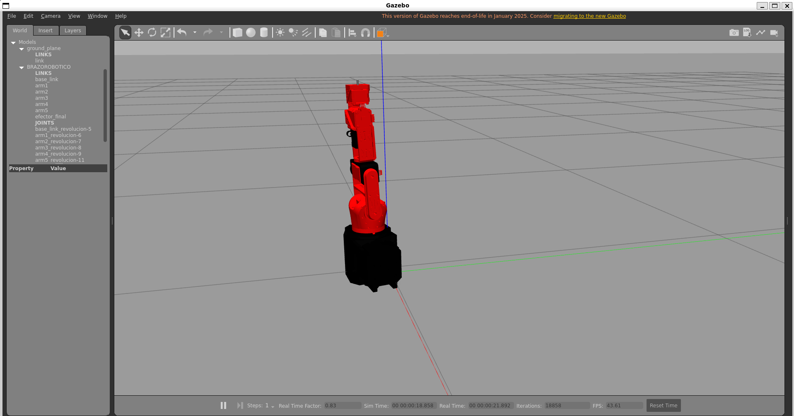
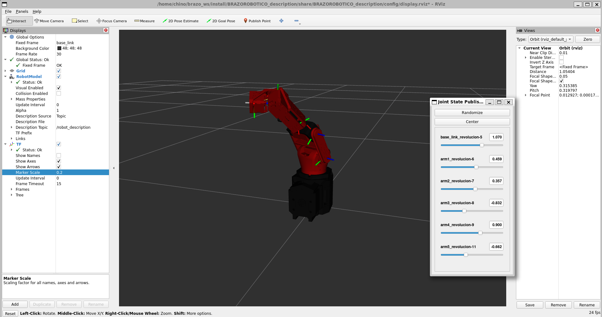
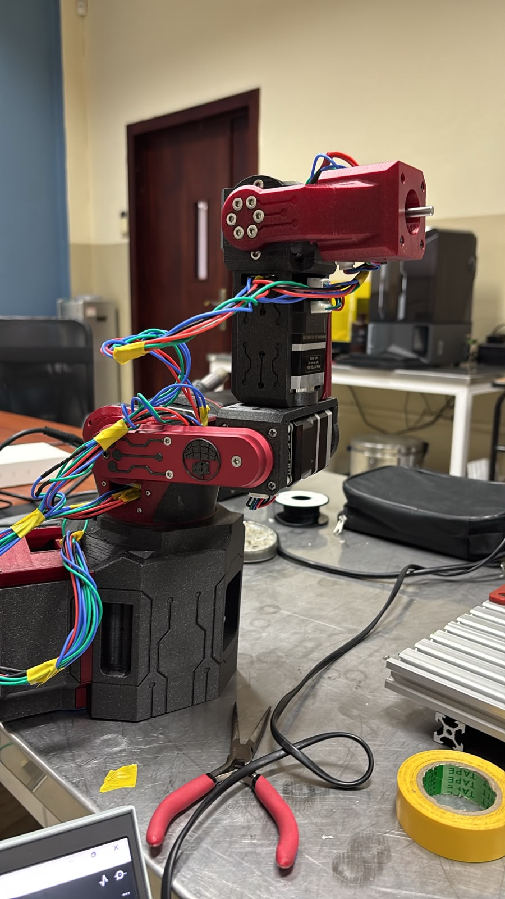

# Brazo Robótico 6 GDL — Gazebo + Cinemática Inversa + ESP32 (micro-ROS)

Workspace de ROS 2 (Humble) para un brazo robótico de 6 grados de libertad:
descripción URDF/Xacro simulable en Gazebo y RViz, un puente de cinemática
inversa/directa propio, y comunicación en tiempo real con firmware en un
ESP32 vía micro-ROS para mover el brazo físico.





## Índice

- [Arquitectura](#arquitectura)
- [Paquetes](#paquetes)
- [Requisitos](#requisitos)
- [Instalación](#instalación)
- [Comandos recomendados](#comandos-recomendados)
- [Estructura del workspace](#estructura-del-workspace)

## Arquitectura

```
 trajectory_publisher            ik_bridge
 (genera trayectoria   --->  /trajectory_chunks  --->  ESP32 (firmware)
  cartesiana del                                       cinemática inversa
  efector final)                                        propia (chunks)
                                                              |
                       <---   /ik_result_chunks   <----------+
                       (ángulos de junta ya resueltos)
                              |
                              v
                       arm_controller (Gazebo) / brazo físico
```

- **trajectory_publisher**: genera una trayectoria cartesiana del efector
  final y la publica en `/trajectory_chunks`, troceada en chunks
  compatibles con el firmware micro-ROS del ESP32.
- **ik_bridge**: puente entre un punto deseado, el firmware ESP32 (resuelve
  la cinemática inversa) y el `arm_controller` simulado. Sigue en tiempo
  real `/joint_states`, envía los puntos objetivo, recibe los ángulos ya
  resueltos y mueve el controlador detectando y avisando saltos bruscos de
  articulación antes de aplicarlos. También expone un nodo de cinemática
  directa propia (`fk_node`) para verificar la pose del efector final de
  forma independiente al URDF/TF.
- **BRAZOROBOTICO_description**: URDF/Xacro, mallas, controladores
  (`ros2_control`) y launch files para visualizar el brazo en RViz o
  simularlo físicamente en Gazebo.
- **micro-ROS-Agent / micro_ros_msgs / micro_ros_setup**: dependencias de
  terceros (micro-ROS) que permiten al ESP32 hablar DDS/ROS 2 sobre
  serial/UDP. No se versionan en este repo, se obtienen con `vcs` (ver
  abajo).

## Paquetes

| Paquete | Tipo | Descripción |
|---|---|---|
| `BRAZOROBOTICO_description` | ament_python | Descripción URDF/Xacro del brazo, mallas, RViz y simulación en Gazebo |
| `ik_bridge` | ament_python | Puente punto deseado ↔ ESP32 (IK) ↔ arm_controller, + nodo de cinemática directa |
| `trajectory_publisher` | ament_python | Generador de trayectorias cartesianas troceadas para el firmware |
| `Trayectorias` | ament_python | Paquete auxiliar de trayectorias |

## Requisitos

- Ubuntu 22.04 + ROS 2 Humble
- `colcon`, `vcs` (`python3-vcstool`)
- Gazebo Classic + `gazebo_ros`, `gazebo_ros2_control`
- `xacro`, `rviz2`, `robot_state_publisher`, `joint_state_publisher(_gui)`
- `python3-numpy`
- Un ESP32 con el firmware micro-ROS del brazo (repo aparte) si vas a
  probar con hardware real

## Instalación

```bash
# 1. Clonar este repo
git clone https://github.com/chinoelmocho/6dof-arm-gazebo-inverse-kinematics-esp32.git ~/brazo_ws
cd ~/brazo_ws

# 2. Traer las dependencias de terceros (micro-ROS) declaradas en src/ros2.repos
vcs import src < src/ros2.repos

# 3. Instalar dependencias de ROS con rosdep
rosdep install --from-paths src --ignore-src -r -y

# 4. Compilar
colcon build --symlink-install

# 5. Cargar el entorno (repetir en cada terminal nueva)
source install/setup.bash
```

## Comandos recomendados

**Ver el brazo en RViz (sin física, solo visualización):**
```bash
ros2 launch BRAZOROBOTICO_description display.launch.py
```

**Simular el brazo en Gazebo con los controladores:**
```bash
ros2 launch BRAZOROBOTICO_description gazebo.launch.py
```

**Levantar el agente micro-ROS para hablar con el ESP32** (ajusta el puerto
serial y baudrate a tu placa):
```bash
ros2 run micro_ros_agent micro_ros_agent serial --dev /dev/ttyUSB0 -b 115200
```

**Enviar un único punto objetivo al puente de IK:**
```bash
ros2 run ik_bridge send_target                       # usa el punto "home"
ros2 run ik_bridge send_target 0.05 0.05 0.30 1 0 0 -1.53
```

**Lanzar el puente de IK (sigue /joint_states, mueve el arm_controller):**
```bash
ros2 run ik_bridge ik_bridge_node
```

**Ver la cinemática directa propia en tiempo real (independiente del URDF/TF):**
```bash
ros2 run ik_bridge fk_node
```

**Generar y publicar una trayectoria circular de prueba:**
```bash
ros2 run trajectory_publisher trajectory_publisher_node \
  --ros-args -p radius:=0.05 -p z_height:=0.20 -p num_points:=200
```

**Recompilar solo un paquete tras editarlo:**
```bash
colcon build --symlink-install --packages-select ik_bridge
```

## Estructura del workspace

```
brazo_ws/
├── src/
│   ├── BRAZOROBOTICO_description/   # URDF, mallas, RViz, Gazebo
│   ├── ik_bridge/                   # Puente IK <-> ESP32 <-> arm_controller
│   ├── trajectory_publisher/        # Generador de trayectorias
│   ├── Trayectorias/                # Paquete auxiliar
│   ├── ros2.repos                   # Dependencias de terceros (micro-ROS)
│   └── uros/                        # (generado por vcs, no versionado)
├── docs/images/                     # Capturas y fotos para este README
├── build/ install/ log/             # Generados por colcon (no versionados)
└── README.md
```

`build/`, `install/` y `log/` se regeneran con `colcon build` y no se suben
al repositorio (ver `.gitignore`).
